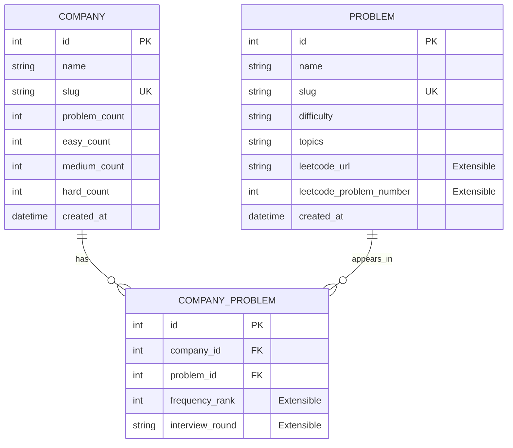

# PrepTrack — Company-Specific DSA Placement Preparation Platform

> **Engineered & Designed with ⚡ by Maharshi**  
> *A production-quality full-stack platform helping software engineering aspirants discover, practice, and track company-specific Data Structures & Algorithms (DSA) questions.*

---

## 🚀 Overview

**PrepTrack** is a high-performance web application built to streamline placement preparation and Online Assessment (OA) revision. 

Rather than sifting through generic problem lists, students can explore questions based on target tech companies (Amazon, Google, Microsoft, Meta, NVIDIA, Apple, Uber, etc.), filter by difficulty and DSA topics, generate custom sprint preparation sets, and monitor their preparation progress with real-time analytics.

---

## 📊 Dataset & Integrity

- **Companies Indexed**: 210 Tech Companies
- **Unique DSA Problems**: 814 Deduplicated Problems
- **Company-Problem Associations**: 11,917 Verified Appearances
- **Data Integrity**: Zero fabricated frequencies or artificial weights. All relationships are mapped from placement assessments.

---

## 🛠️ Tech Stack

### Frontend
- **Framework**: React 18 + TypeScript + Vite 8
- **Styling**: Tailwind CSS v4 + Custom Glassmorphism System
- **Icons**: Lucide React
- **Effects**: Canvas Confetti (Celebratory feedback on solve)
- **Theme**: Dark & Light mode persistence
- **State**: Reactive Context API + URL Query Synchronization + LocalStorage

### Backend
- **Framework**: FastAPI (Python 3.11+)
- **ORM**: SQLAlchemy 2.0
- **Validation**: Pydantic v2
- **Database**: PostgreSQL (with automatic zero-config SQLite fallback for offline development)
- **Architecture**: Service Repository Pattern with RESTful API Design

### DevOps & Tooling
- **Containerization**: Docker & Docker Compose
- **Web Server**: Nginx (Production reverse proxy)

---

## 🏛️ Database Architecture

The data model follows strict normalization to prevent redundant problem duplication across companies:



---

## ✨ Key Features

1. **Company Directory & Analytics (`/companies`)**:
   - Searchable grid of all 210 companies with difficulty distribution bars (Easy/Medium/Hard).
   - Multi-sort: Most Questions, Alphabetical (A-Z/Z-A), Most Hard Questions, Most Easy Questions.

2. **Company Detail & Preparation Mode (`/companies/:slug`)**:
   - Company-specific problem listing with multi-topic and difficulty filtering.
   - **Preparation Mode (Sprint Generator)**: Pick target difficulties and problem count (10, 25, 50, all) to create a focused revision plan.

3. **All Problems Explorer (`/problems`)**:
   - Browse 814 unique problems across all companies.
   - View which companies ask each problem (e.g. `Two Sum` → Amazon · Google · Microsoft · Meta).

4. **Problem Detail & Notes (`/problems/:slug`)**:
   - Detailed view showing all asking companies, difficulty badge, topics.
   - In-app personal solution notes editor for time/space complexity and tricky edge cases.
   - Extensible LeetCode practice button.

5. **Personal Preparation Dashboard (`/dashboard`)**:
   - Track solved vs. attempted vs. not-started problems.
   - Company readiness progress bars (e.g. Amazon 80% Ready).
   - Bookmark system for last-minute revision before technical rounds.

6. **Global Search (`Ctrl + K` / `Cmd + K`)**:
   - Instant command palette searching across companies, DSA problems, and topics.

---

## 🏃 Quickstart Guide

### Prerequisites
- Python 3.10+
- Node.js 18+ and npm
- PostgreSQL (optional, SQLite fallback works out of the box)

---

### Method 1: Local Development

#### 1. Backend Setup
```bash
# Navigate to project root
cd backend

# Install dependencies
pip install -r requirements.txt

# Run CSV data import pipeline
python ../scripts/import_data.py

# Start FastAPI development server
uvicorn app.main:app --host 127.0.0.1 --port 8000 --reload
```
API Documentation will be live at: `http://localhost:8000/docs`

#### 2. Frontend Setup
```bash
# In a new terminal, navigate to frontend
cd frontend

# Install packages
npm install

# Start Vite dev server
npm run dev
```
Web application will be running at: `http://localhost:5173`

---

### Method 2: Docker Compose

```bash
docker-compose up --build
```
- Frontend: `http://localhost:3000`
- Backend API: `http://localhost:8000`
- API Docs: `http://localhost:8000/docs`

---

## 📡 REST API Reference

| Method | Endpoint | Description |
|---|---|---|
| `GET` | `/api/stats` | Aggregated platform metrics and top topics |
| `GET` | `/api/companies` | Paginated company list with search and sorting |
| `GET` | `/api/companies/{slug}` | Company details and difficulty breakdown |
| `GET` | `/api/companies/{slug}/problems` | Company problems with multi-topic/difficulty filters |
| `GET` | `/api/problems` | All unique problems across all companies |
| `GET` | `/api/problems/{slug}` | Problem details, related questions & asking companies |
| `GET` | `/api/problems/preparation-set` | Custom sprint problem set generator |
| `GET` | `/api/topics` | All unique topics with frequency counts |
| `GET` | `/api/health` | Service health status |

---

## 👨‍💻 Author

**Maharshi**  
*Placement Preparation Architect & Full-Stack Engineer*
